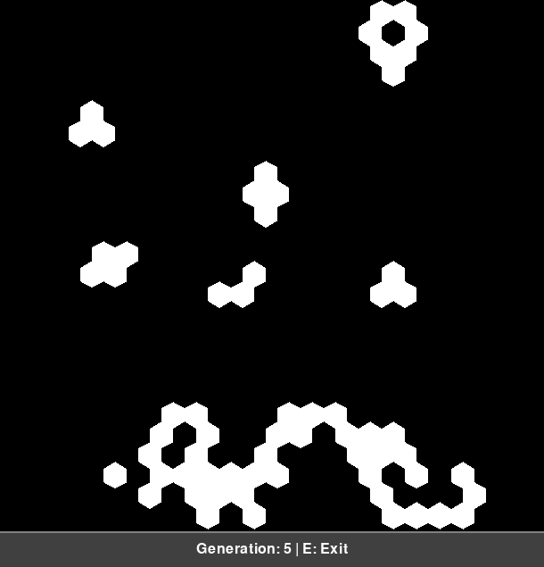
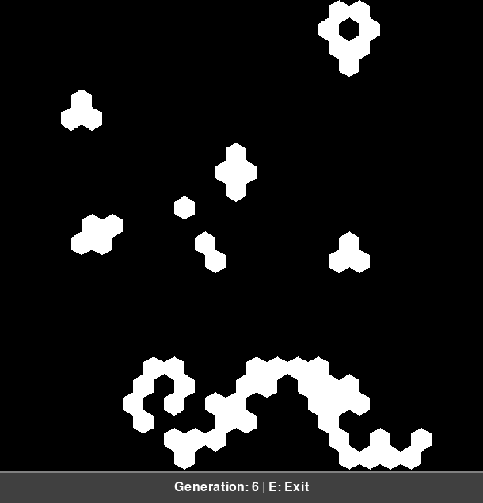

# Hexagonal Game of Life

A Python implementation of Conway's Game of Life on a hexagonal grid, extended with custom rules for aging, random resurrection, and no-repeat death causes.

---

## Table of Contents

1. [Introduction](#introduction)
2. [Installation](#installation)
3. [Usage](#usage)
4. [Theory](#theory)
   * [Hexagonal Cellular Automaton](#hexagonal-cellular-automaton)
   * [Custom Rules](#custom-rules)
5. [Visualization](#visualization)
6. [File Structure](#file-structure)
7. [Contributing](#contributing)
8. [License](#license)

---

## Introduction

This project implements a variant of Conway's Game of Life on a **hexagonal grid**, adding mechanics for cell aging, periodic random revivals, and preventing consecutive deaths for the same cause. The simulation is built with **Pygame** for rendering and **NumPy** for efficient array operations.

## Installation

1. Clone the repository:

   ```bash
   git clone https://github.com/yourusername/hex-life
   cd hex-life
   ```

2. (Optional) Create and activate a virtual environment:

   ```bash
   python -m venv venv
   source venv/bin/activate  # On Windows use `venv\Scripts\activate`
   ```

3. Install dependencies:

   ```bash
   pip install -r requirements.txt
   ```

## Usage

Run the simulation:

```bash
python hex_life.py
```

* **Draw** initial live cells by **clicking and dragging** with the mouse.
* Press **Space** to **start/pause** the simulation.
* Generated frames will be saved as `output1.png`, `output2.png`, etc.

## Theory

## Theory

### Hexagonal Grid to Array Mapping

In our implementation, each hexagon in the grid is mapped to a 2D array index by projecting its center onto Cartesian coordinates. By computing the row and column offsets (using the hexagon’s radius and the √3/2 vertical spacing), we can translate any hex cell into a (row, col) pair in a regular 2D array.

In our implementation, each hexagon in the grid is mapped to a 2D array index by projecting its center onto Cartesian coordinates.  By computing the row and column offsets (using the hexagon’s radius and the √3/2 vertical spacing), we can translate any hex cell into a (row, col) pair in a regular 2D array.


### Rules

All of the custom rules for this hexagonal automaton are defined in [rules.txt](rules.txt)

## Visualization

Below are sample frames from the simulation:

<p float="left">
  
  
</p>

*(Place additional illustrative images in the `Output/` folder.)*

## File Structure

```
hex-life/
├── main.py           # Main simulation script
├── requirements.txt  # Pinned dependencies
├── rules.txt         # Custom rules 
├── README.md         # Project documentation
└── Output/           # Sample frames and diagrams
    ├── output1.png
    ├── output2.png
    .
    .
```

## Contributing

Contributions are welcome! Please:

1. Fork the repository
2. Create a new branch (`git checkout -b feature/YourFeature`)
3. Commit your changes
4. Push to the branch
5. Open a Pull Request

## License

This project is licensed under the MIT License. See [LICENSE](LICENSE) for details.

